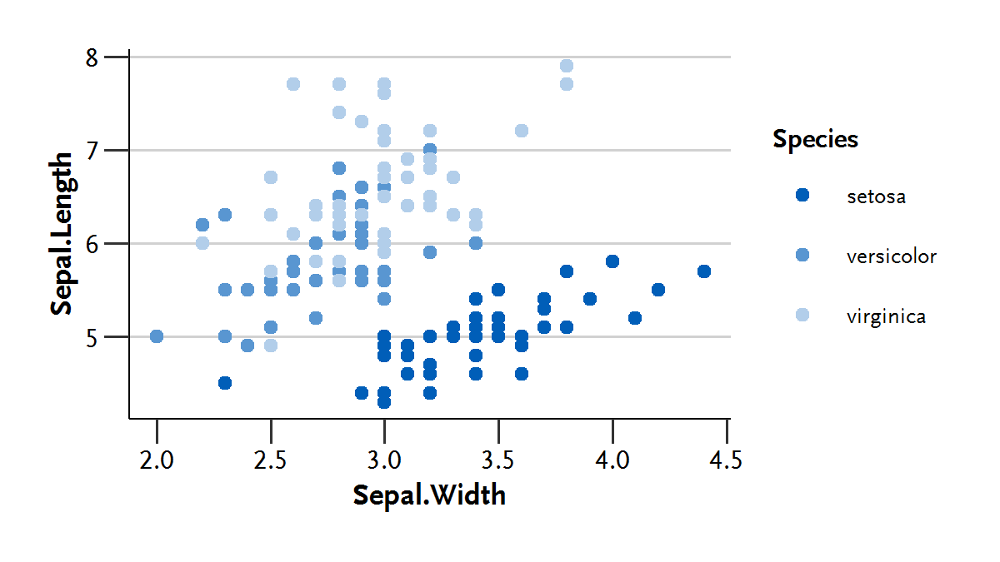

# R package rkicolors
This unofficial R Package applies a RKI-like theme to a ggplot2 plot and also includes different color/fill palettes based on the RKI Corporate Design.

## Installation
```R
devtools::install_github("lekroll/rkicolors")
```

## Example
```R
library("rkicolor")
library("ggplot2")
library("extrafont")

ggplot(iris, aes(Sepal.Width, Sepal.Length, color = Species)) +   
geom_point() + 
theme_rki(base_family="ScalaSansLF-Regular", 
          bold_family="ScalaSansLF-Bold", 
          base_size = 10) +
scale_color_rki()
```


## Package Vignette
For more info see the [rkicolor Vignette](https://lekroll.github.io/rkicolors/inst/doc/rkicolors-vignette.html).
